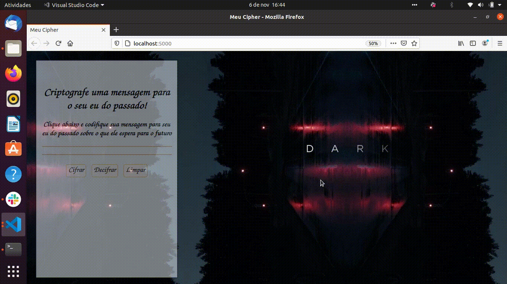

# Cifra de César

## Índice

* [1. Introdução](#1-Introducao)
* [2. ferramentas de uso](#2-Ferramentas-de-uso)
* [3. Objetivo e modo de uso](#3-Objetivos-de-aprendizagem)
* [4. Tema ](#4-Tema)
* [5. Usuário ](#5-Usuario)
* [6. Planning do processo de desenvolvimento](#6-Planning-do-processo-de-desenvolvimento)
* [7. Resultado](#7-Resultado)

***

## 1. Introdução
A ideia do projeto, era desenvolver um programa que dê ao usuário um campo de preenchimento onde ao inserir uma frase a mesma possa ser cifrada e decifrada de acordo com a técnica da Cifra de César. Nesta tecnica, cada letra do texto inserido é substituido por outra palavra de acordo com o offset inserido pelo usuário, onde de acordo com esse numero offset irá navegar pelo alfabeto trazendo a nova letra.

## 2. Ferramentas de uso

- HTML e CSS
    Uso de HTML semântico.
    Uso de seletores de CSS.

- DOM

    Uso de seletores do DOM.
    Manipulação de eventos do DOM.
    Manipulação dinâmica do DOM. (createElement | innerHTML | textContent | etc.)

- JavaScript

    Manipulação de strings.
    Uso de condicionais (if-else)
    Uso de laços (loops) (for)
    Uso de funções (parâmetros | argumentos | valor de retorno)

## 3. Objetivo e modo de uso

O Objetivo do projeto é cifrar e decifrar uma frase inserida pelo usuário.

:arrow_right: Em primeiro lugar, o usuário irá clicar no botão "Cifrar", onde abrirá um campo para o mesmo inserir a palavra e o numero. Logo abaixo, aparecerá sua mensagem criptografada!

:arrow_right: Feito isso, é só clicar no botão "Decifrar" que sua mensagem descriptografada aparecerá logo abaixo da criptografada.

:arrow_right: Para limprar as informações e começar novamente, basta clicar no botão "limpar".

## 4. Tema

Foi inspirado numa série de televisão chamada Dark é uma premiada websérie alemã de drama, suspense e ficção científica, onde a viagem no tempo é o tema principal da série. A história se desenvolve, principalmente, em três períodos diferentes: 1953, 1986 e 2019-2020 e você acompanha e ve os personagens em várias fases da vida simultâneamente, geralmente em três versões: criança, adulto e idoso. Os viajantes comunicam-se inclusive consigo mesmo em diferentes épocas.

Bibliografia:
https://entretenimento.uol.com.br/noticias/redacao/2020/07/03/o-guia-para-entender-dark-e-conseguir-conversar-com-seus-amigos.htm

## 5. Usuário

É destinado ao entreterimento, para quem aprecia a websérie. No caso, o usuário estará mandando uma mensagem criptografada para o seu eu do passado dando informações importantes sobre o futuro.

## 6. Planning do processo de desenvolvimento.

- Sprint 1

:heavy_check_mark: Estudo da cifra de cézar

:heavy_check_mark: Estudo de funções no JS, manipulação do DOM e strings, buscar informações sobre CSS

:heavy_check_mark: Definir um tema

:heavy_check_mark: Escrever o processo de lógica

:heavy_check_mark: Montar estrutura HTML

- Sprint 2

:heavy_check_mark: Iniciar a lógica dentro do código declarando variáveis e montando as funções

:heavy_check_mark: Trabalhar na manipulação do DOM

:heavy_check_mark: Iniciar o CSS

:heavy_check_mark: Realizar testes NPM

:heavy_check_mark: Fazer testes verificando se há bugs e problemas de função

:heavy_check_mark: Dar review nas regras do HTML semântico, aprimorar o CSS.

## 7. Resultado

